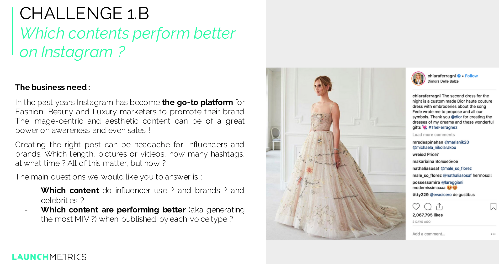
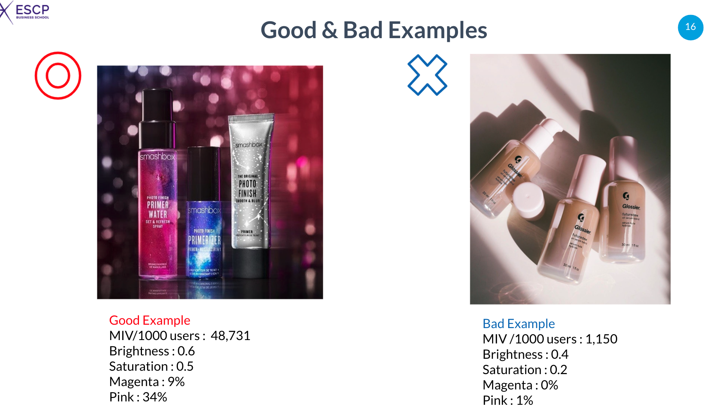

# Datathon for Influencer Marketing
This is the repository for Launchmetrics Datathon. Tried instagram image color property analysis with OpenCV using HSV and RGB color space.

## Business context

## My solution

