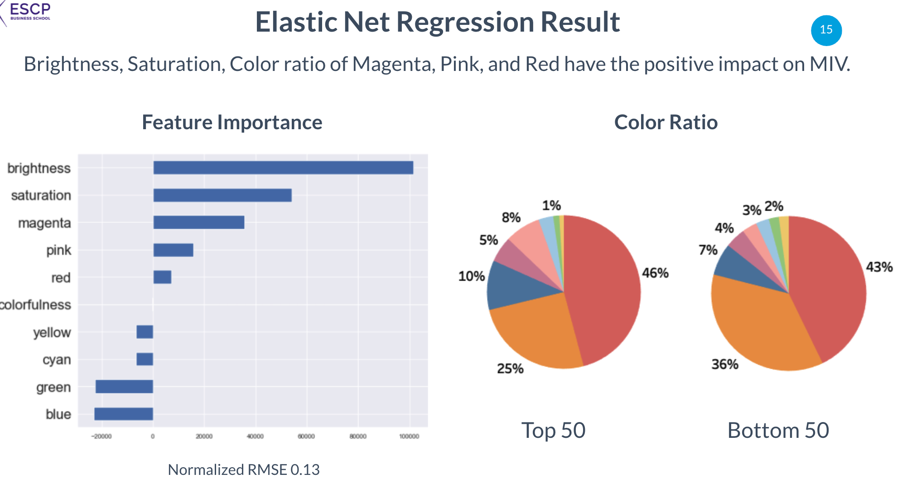

# Improve Influencer Marketing for Luxuary brands
Datathon of [Launchmetrics](https://www.launchmetrics.com/) and ESCP in 2020. The goal was to increase the revenue from Instagram posts.

## Business context

  

## My solution

- First download around 20K instagram images of company's influencers
- Vectorized the color properties, 1. Colourfulness 2. Saturation 3. Brightness and 4. Color ratio
- For 1, calculated the differences between RGB colors, and took variance as the vector
- For 2 & 3, used took the values that are calculated with OpenCV package
- For 4, used HSV color-space, classified each pixel into 8 colors and divided by total number of pixels in the image

  

  

